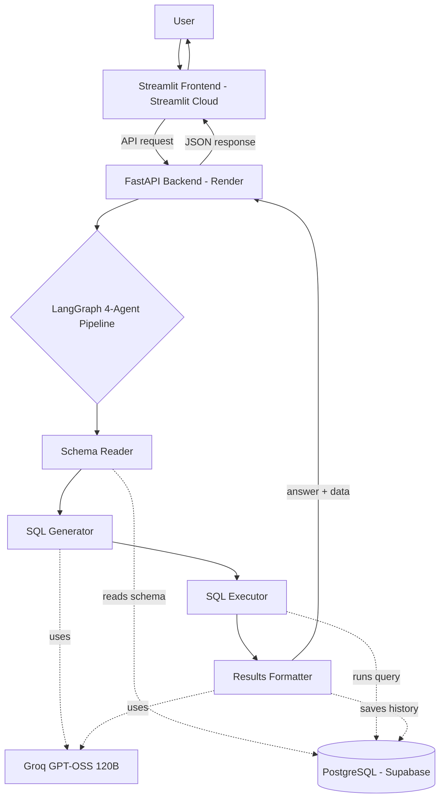
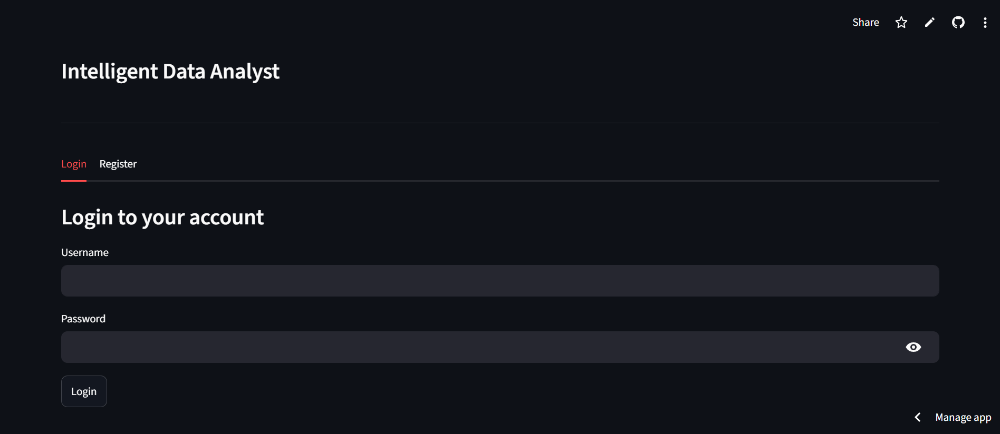
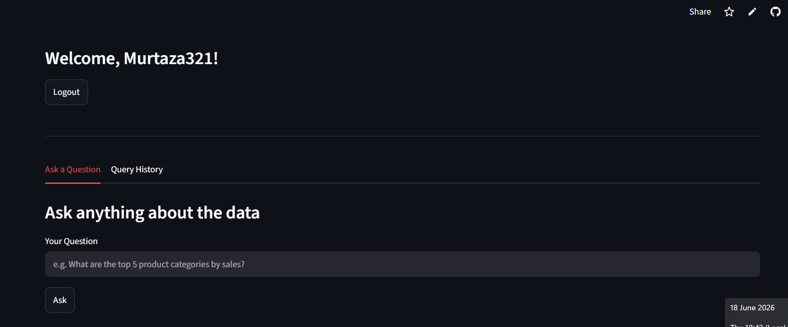
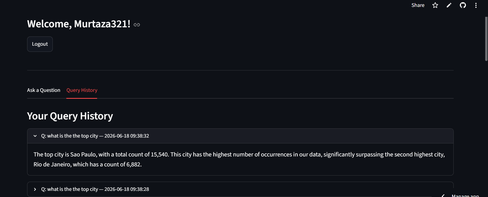

# 🧠 DataMind AI — Talk to Your Database in Plain English

A full-stack AI data analyst that lets non-technical users query a 100,000+ row database by asking questions in plain English — no SQL required. Built with a LangGraph multi-agent pipeline, a FastAPI backend, and a Streamlit frontend.

## 🚀 Live Demo
- **App:** [Try it here](https://datamind-ai-bmzbmbz4itgvehf5lequrt.streamlit.app)


## 📌 The Business Problem
Companies sit on huge amounts of data, but **only technical staff can query it.** A marketing manager who wants "top 5 product categories by sales" has to wait for an analyst to write the SQL. This creates bottlenecks and slows decisions.

**DataMind AI removes that bottleneck** — anyone can ask business questions in plain English and get instant answers, charts, and the underlying data, without knowing SQL.


## 🏗️ Architecture



## ⚙️ How It Works — 4-Agent Pipeline
1. **Schema Reader** — reads the live database structure so the LLM knows what tables/columns exist
2. **SQL Generator** — converts the plain-English question into a valid PostgreSQL query
3. **SQL Executor** — runs the query against the database and retrieves results
4. **Results Formatter** — turns raw data into a clear, friendly answer (and saves to history)

## 📊 Dataset
**Olist Brazilian E-Commerce** (public Kaggle dataset) — real anonymized data:
- 99,441 customers
- 99,441 orders
- 112,650 order items
- 32,951 products
- 103,886 payments

## ✅ Results / What It Does
- Handles a **100,000+ row** real database via natural-language questions
- **Multi-agent SQL generation** with **hallucination prevention** — if a query fails, it returns a safe message instead of inventing data
- **Automatic Plotly charts** chosen based on the question (bar / horizontal bar / line / pie)
- **Persistent storage** (PostgreSQL on Supabase) — users and history survive server restarts
- **Production hardening** — health check endpoint + rate limiting

## 📸 Screenshots

**Login screen**


<br>

**Asking a question with a chart**



<br>

**Query history**



<br>

## 🛠️ Tech Stack
- **Backend:** FastAPI (deployed on Render)
- **Frontend:** Streamlit (deployed on Streamlit Cloud)
- **Agents:** LangGraph (4-agent pipeline)
- **LLM:** Groq + GPT-OSS 120B
- **Database:** PostgreSQL (Supabase)
- **Visualization:** Plotly
- **Auth:** SHA-256 password hashing
- **Production:** health check endpoint, rate limiting (slowapi)

## 🔌 API Endpoints
| Method | Endpoint | Purpose |
|---|---|---|
| GET | `/health` | Health check for monitoring |
| POST | `/register` | Create a user account |
| POST | `/login` | Authenticate a user |
| POST | `/ask` | Ask a question → runs the 4-agent pipeline |
| GET | `/history/{username}` | Get a user's query history |

## ▶️ Run Locally
1. Clone the repo:
```
git clone https://github.com/Murtaza-data/datamind-ai.git
cd datamind-ai
```
2. Install dependencies:
```
pip install -r requirements.txt
```
3. Set environment variables:
```
GROQ_API_KEY=your_groq_key
DATABASE_URL=your_postgresql_connection_string
```
4. Run the backend:
```
python main.py
```
5. Run the frontend:
```
streamlit run app.py
```
